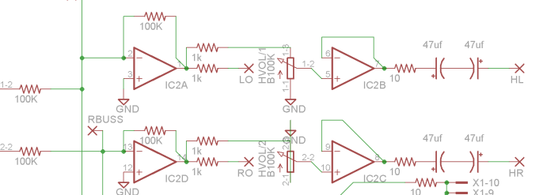
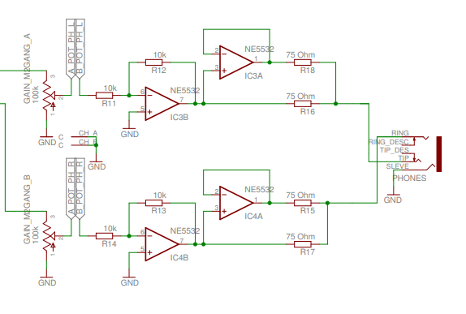
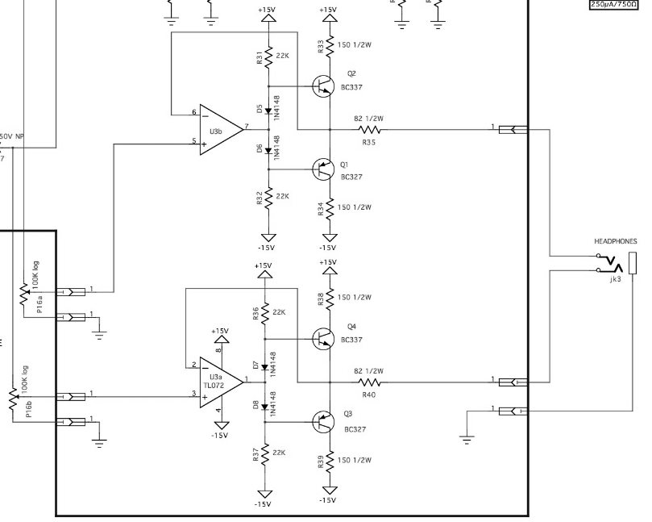
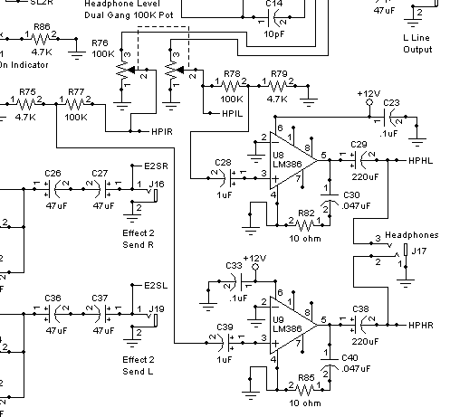
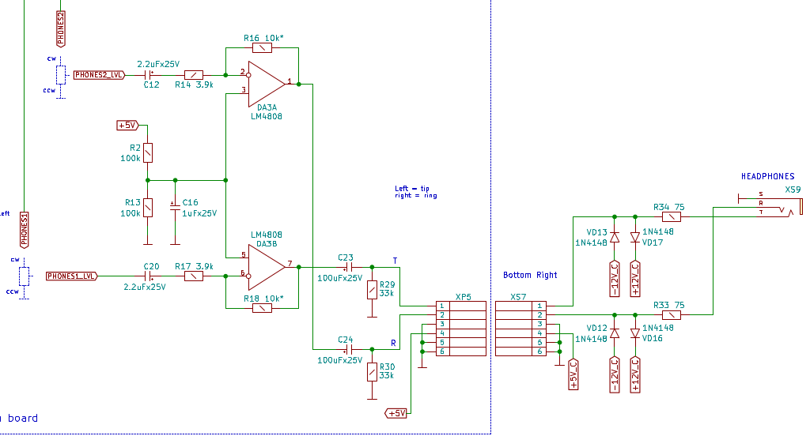

# Stereo output / Kosmo

This is a work in progress.

**Untested hardware and software — Do not assume anything works!**

There are some aspects of the [Barton Stereo Outs](https://www.bartonmusicalcircuits.com/stereoouts/index.html)  module that I want to change.

There are 4 single gang pots, 5 dual gang pots, 6 mono jacks, and 1 stereo jack. In Barton's design the dual gang pots are board mounted and the rest of the pots and the jacks are panel mounted. But the dual gang pots are too close together for a satisfactory Kosmo module. They could be panel mounted, but then the amount of wiring required would be very high. Since most of the pads for the board mounted pots and the wiring are at spacings of 0.1" or multiples, one could instead mount pin headers to plug into pin sockets on a separate board for vertical board mounted pots, into which a third board for board mounted jacks could also plug.

The original design lacks a gain control on the mixing stage. This would not be hard to address, but it adds another dual gang pot to wire if the pot panel board is not done.

Possibly the most serious issue is the headphone output. The design puts each line output through an attenuator, a TL074 voltage follower, a 10 Ω resistor, and two 47 µF capacitors antiparallel in series, before going to the headphone jack:

My understanding is that the TL074 cannot satisfactorily drive low impedance headphones. Reviewing headphone outputs from other modules:

The [Befaco OutV3](https://www.befaco.org/out-v3/) uses op amps, but specifies the NE5532 which apparently can source more current than the TL07x:
 

[YuSynth's Mixout-VC Panner](http://yusynth.net/Modular/EN/MIXOUT/index.html) uses TL072s, followed by BC327 and BC337 transistors which I suppose do the heavy lifting:

[MFOS's Stereo Mixer](http://musicfromouterspace.com/index.php?MAINTAB=SYNTHDIY&PROJARG=STEREOMIXER2006/STEREOMIXER2006.php&CATPARTNO=PCBMFSTEREOMIX&PN=1&SONGID=NONE) uses LM386 audio amplifier chips:

and [EricaSynths' Output DIY](https://github.com/erica-synths/diy-eurorack/blob/master/Output%20DIY.zip) uses the LM4808 amplifier, designed for driving headphones:

Five modules, five completely different ways of doing the job.

Perhaps my misgivings about Barton's design are unfounded. Perhaps they aren't. Either way there is some breadboarding to be done. If Barton's design is unsatisfactory then an alternate design could be incorporated into the pots panel board, or yet another auxiliary board. 

On the other hand, these modifications add up to a lot; it might be better to put the Barton PCB aside and design a new one.

## Update

Breadboarding shows the Barton headphone circuit does work; I'm surprised, frankly. This does not mean it's the best headphone circuit. I'm leaning in favor of using the LM4808 as in the Erica Synths module; it's made for driving low impedance. (So is the LM386, but I'd need two of them versus one of the LM4808, and my initial attempt to breadboard the MFOS LM386 circuit was unsatisfactory — maybe wrong version of the 386?) In addition there are aspects of the Barton circuit aside from the headphones part I now think I'd like to change: AC coupled inputs, reduced impedances and high pass filtering in the mixing stages, overvoltage protection on the outputs.

So it looks like I'm heading toward a new board design.
