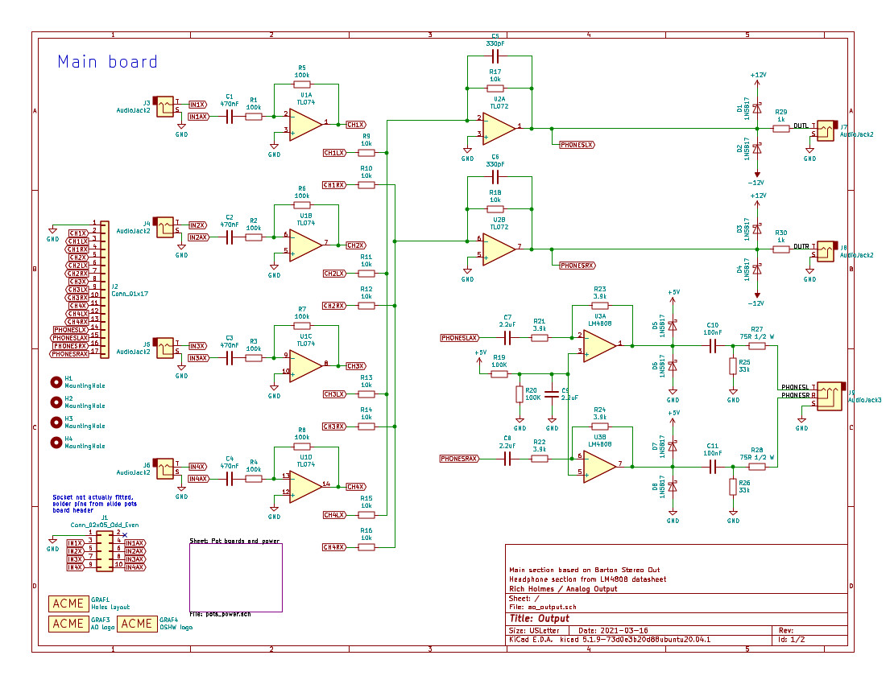
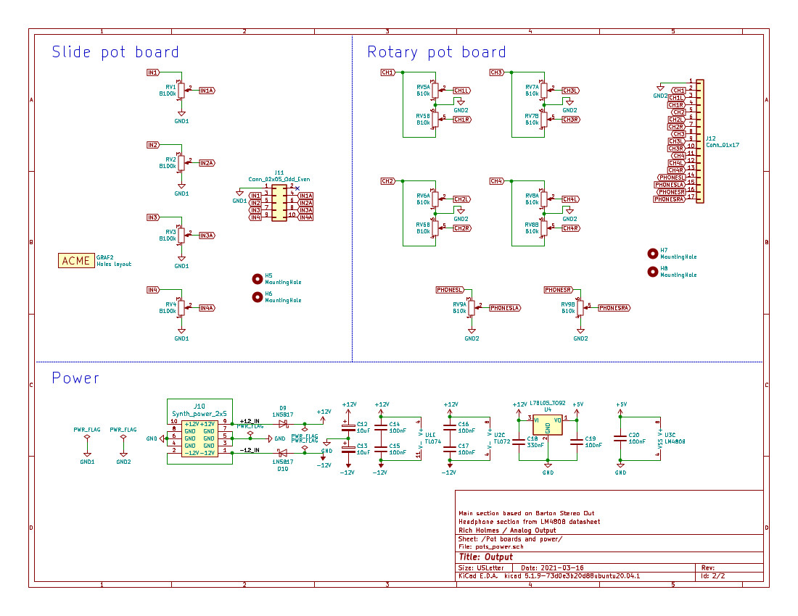

# Stereo output / Kosmo

This is a work in progress.

**Untested hardware — Do not assume anything works!** Breadboard tested only.

Stereo output synthesizer module in Kosmo format.

This is somewhat based on the [Barton Stereo Outs](https://www.bartonmusicalcircuits.com/stereoouts/index.html)  module. There are four AC coupled inputs with pan and level controls. 

The headphone output section is based on the LM4808 datasheet circuit. This is an SMD (SOIC-8) part; all other components are through hole.

 

 