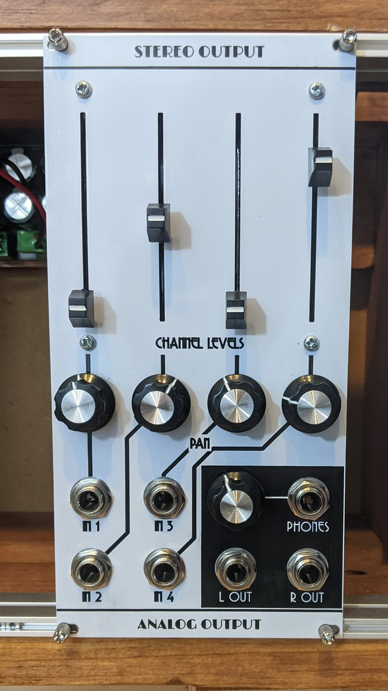

# Stereo output / Kosmo

Stereo output synthesizer module in Kosmo format.

This is somewhat based on the [Barton Stereo Outs](https://www.bartonmusicalcircuits.com/stereoouts/index.html)  module. There are four AC coupled inputs with pan and level controls. 

The headphone output section is based on the LM4808 datasheet circuit. This is an SMD (SOIC-8) part; all other components are through hole.

I've built this but my mechanical design was frankly stupid. I ended up kludging it together in a somewhat horrible way. I have eliminated the PCB design file and Gerbers from this repository; do better ones yourself! The circuit design is fine as far as I can see. So is the front panel except the slider mounting screws holes would be eliminated if I were to do it over.

## Photo



## Documentation:

* [Schematic](Docs/ao_output.pdf)
* [BOM](Docs/ao_output_bom.md)

## Submodules

This repo uses submodules aoKicad and Kosmo_panel, which provide needed libaries for KiCad. To clone:

```
git clone git@github.com:holmesrichards/audiomixer.git
git submodule init
git submodule update
```

Alternatively do

```
git clone --recurse-submodules git@github.com:holmesrichards/audiomixer.git
```

Or if you download the repository as a zip file, you must also click on the "aoKicad" and "Kosmo\_panel" links on the GitHub page (they'll have "@ something" after them) and download them as separate zip files which you can unzip into this repo's aoKicad and Kosmo\_panel directories.

If desired, copy the files from aoKicad and Kosmo\_panel to wherever you prefer (your KiCad user library directory, for instance, if you have one). Then in KiCad, add symbol libraries 

```
aoKicad/ao_symbols
Kosmo_panel/Kosmo
```
and footprint libraries 
```
aoKicad/ao_tht
Kosmo_panel/Kosmo_panel.
```